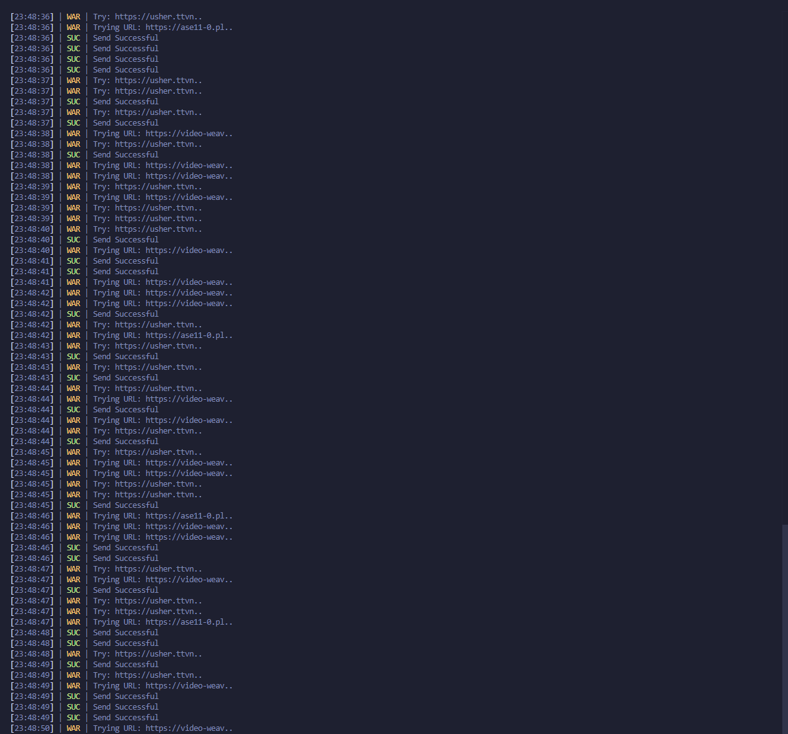

# twitch viewer
Increases the number of simultaneous connections on Twitch.

It is written in python and runs on threads, and can increase the number of users by 80-120 with about 10 threads.

If you want the source code, please contact us.

discord | solton_e

[Discord invite](https://discord.gg/no)

There are no invites yet.

# Preview
console log
